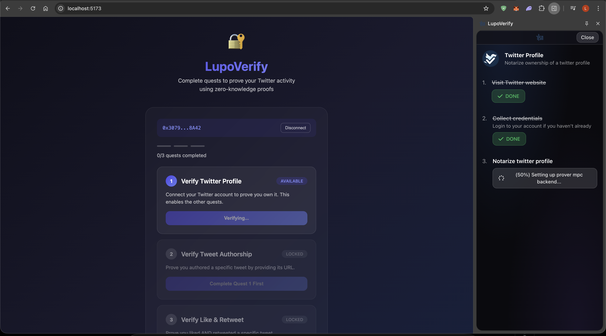
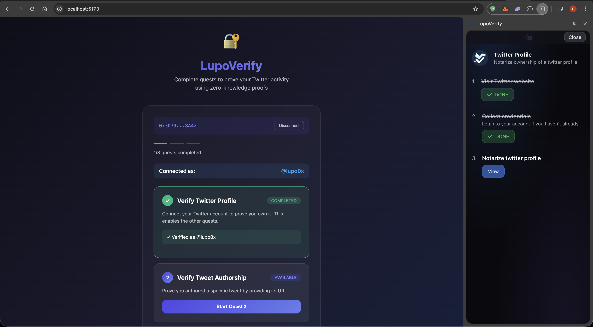

# LupoVerify - ZK Twitter Quest System

Zero-knowledge Twitter verification POC with a 3-quest system. Prove your Twitter identity and actions using cryptographic proofs powered by TLSNotary's MPC-TLS protocol.

## Screenshots

| Verification In Progress | Verification Completed |
|--------------------------|------------------------|
|  |  |

## Related Repositories

- **[LupoVerify Extension](https://github.com/LucianoLupo/lupo-verify-extension)** - Fork of TLSNotary extension with dark glass UI theme

## Features

- **Quest 1**: Verify Twitter profile ownership
- **Quest 2**: Prove you authored a specific tweet
- **Quest 3**: Prove you liked AND retweeted a specific tweet
- **Wallet Integration**: MetaMask signature required for all submissions
- **Dark Glass UI**: Modern glassmorphism design theme
- **Real-time Progress**: Live notarization progress in extension side panel

## Tech Stack

| Component | Technology |
|-----------|------------|
| Frontend | React 18 + Vite + wagmi |
| Backend | NestJS + SQLite |
| Verifier | Rust + tlsn-core |
| Extension | TLSNotary fork (MV3) |
| Proofs | TLSNotary MPC-TLS |

## Architecture

```
┌─────────────────────────────────────────────────────────────────────────┐
│                              USER'S BROWSER                              │
│  ┌─────────────────────┐     ┌─────────────────────────────────────────┐ │
│  │   React Frontend    │     │      LupoVerify Extension               │ │
│  │   (Quest UI)        │◄────│  ├── quest-1-profile.wasm               │ │
│  │   Port: 5173        │     │  ├── quest-2-tweet.wasm                 │ │
│  └──────────┬──────────┘     │  └── quest-3-engagement.wasm            │ │
└─────────────┼────────────────└──────────────────┬──────────────────────┘
              │ REST API                          │ MPC-TLS
              ▼                                   ▼
┌─────────────────────────┐     ┌─────────────────────────────────────────┐
│    NestJS Backend       │     │         Notary Infrastructure           │
│    Port: 3000           │     │  ┌─────────────┐ ┌─────────────────────┐ │
│    SQLite DB            │     │  │ Notary 7047 │ │ wstcp Proxy 55688   │ │
└─────────────┬───────────┘     │  └─────────────┘ └─────────────────────┘ │
              │                 └─────────────────────────────────────────┘
              ▼
┌─────────────────────────┐
│   Rust Verifier         │
│   Port: 8080            │
│   (tlsn-core)           │
└─────────────────────────┘
```

## Quick Start

### Prerequisites

1. **Node.js** v18+
2. **Rust** (for verifier and notary)
3. **[LupoVerify Extension](https://github.com/LucianoLupo/lupo-verify-extension)** (built from source)
4. **MetaMask** or compatible Ethereum wallet

### 1. Clone and Setup Extension

```bash
git clone https://github.com/LucianoLupo/lupo-verify-extension.git
cd lupo-verify-extension
npm install
npm run build
# Load build/ folder in chrome://extensions (Developer mode)
```

### 2. Start the Local Notary Server

```bash
# Clone and build TLSNotary
git clone https://github.com/tlsnotary/tlsn.git
cd tlsn
cargo build --release -p notary-server

# Run notary server
./target/release/notary-server --config ~/.notary-server/config/config.yaml
```

### 3. Start the WebSocket Proxy

```bash
cargo install wstcp
wstcp --bind-addr 127.0.0.1:55688 api.x.com:443
```

### 4. Start the Rust Verifier

```bash
cd verifier
RUST_LOG=info cargo run
# Listening on http://localhost:8080
```

### 5. Start the Backend

```bash
cd backend
npm install
npm run start:dev
# API running on http://localhost:3000
```

### 6. Start the Frontend

```bash
cd frontend
npm install
npm run dev
# App running on http://localhost:5173
```

## Quest System

### Quest 1: Verify Twitter Profile
- **Purpose**: Prove you own a Twitter account
- **API**: `GET /1.1/account/settings.json`
- **Reveals**: `screen_name` only
- **Prerequisites**: None

### Quest 2: Verify Tweet Authorship
- **Purpose**: Prove you wrote a specific tweet
- **API**: `GET /1.1/statuses/show.json?id={tweet_id}`
- **Input**: Tweet URL
- **Reveals**: `id_str`, `user.screen_name`, `full_text`
- **Prerequisites**: Quest 1

### Quest 3: Verify Like & Retweet
- **Purpose**: Prove you liked AND retweeted a tweet
- **API**: Twitter GraphQL TweetDetail
- **Input**: Tweet URL
- **Reveals**: `favorited`, `retweeted` flags
- **Prerequisites**: Quest 1

## API Endpoints

### Quest Progress
```
GET /api/quest/progress/:walletAddress
```

### Submit Quest Proof
```
POST /api/quest/:questNumber/submit
{
  "walletAddress": "0x...",
  "proof": { ... },
  "signature": { ... },
  "tweetUrl": "https://x.com/..." // For Quest 2/3
}
```

## Project Structure

```
zk-twitter-verifier/
├── backend/           # NestJS API + SQLite
├── frontend/          # React + Vite + wagmi
├── verifier/          # Rust proof verification (tlsn-core)
└── plugins/           # TLSNotary WASM plugins
    ├── quest-1-profile/
    ├── quest-2-tweet/
    └── quest-3-engagement/
```

## Ports

| Service | Port |
|---------|------|
| Notary Server | 7047 |
| wstcp Proxy | 55688 |
| Rust Verifier | 8080 |
| Backend API | 3000 |
| Frontend | 5173 |

## How It Works

1. **Connect Wallet**: User connects MetaMask to the frontend
2. **Start Quest**: Click "Start Quest" to trigger plugin execution
3. **Extension Popup**: LupoVerify extension shows approval dialog
4. **MPC-TLS Notarization**: Extension performs TLS session with Twitter API via notary
5. **Proof Generation**: WASM plugin extracts and redacts data, generates ZK proof
6. **Wallet Signature**: User signs the submission with MetaMask
7. **Backend Verification**: Rust verifier validates the TLSNotary proof
8. **Quest Completion**: Backend records completion in SQLite database

## License

MIT
